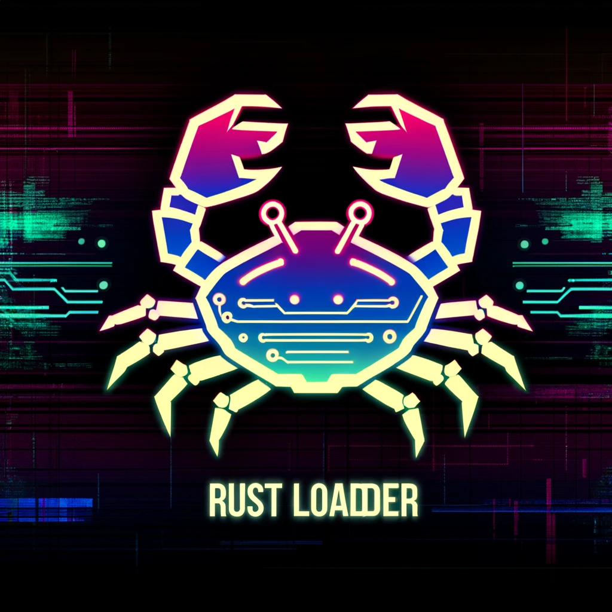

# RustLoader

🦀🦀
### Descripción del Proyecto
RustLoader es un proyecto avanzado en Rust que implementa un cargador de shellcode utilizando la API de Windows y ensamblador en línea. Este proyecto se enfoca en técnicas de bajo nivel para la manipulación de memoria y el parcheo de procesos, con características adicionales de anti-depuración y monitoreo de clics del ratón.

### Características
- **Cargador de Shellcode:** Ejecuta shellcode desde la memoria después de descifrarlo.
- **Operaciones de Memoria de Bajo Nivel:** Utiliza Rust y ensamblador en línea para la asignación y manipulación precisa de memoria.
- **Parcheo de Procesos:** Aplica parches a funciones críticas del sistema utilizando `WriteProcessMemory`.
- **Anti-Debugging:** Detecta la presencia de depuradores y termina el proceso si se encuentra uno.
- **Detección de Clics del Ratón:** Monitorea y responde a los clics del ratón utilizando la función `GetAsyncKeyState` de la API de Windows.

### Requisitos del Sistema
- Sistema Operativo: Windows
- Lenguaje de Programación: Rust
- Herramientas Adicionales: Cargadores y herramientas de desarrollo de Rust

⚠️ DISCLAIMER
These tools and scripts are provided for educational purposes only. Unauthorized testing of networks and systems is illegal. Always obtain permission before attempting any penetration testing.